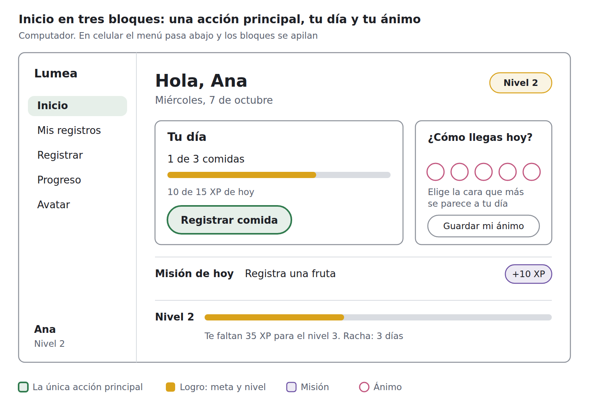

# El Inicio nuevo (exportado del documento «Rediseño»)

Esta es una copia de dos secciones del documento «Rediseño», que es un documento de Claude y no se puede leer desde el repositorio. Si este archivo y `docs/tickets/MISION-rediseno.md` no coinciden, manda la misión, porque tiene las decisiones del 7 de octubre.

## Dirección

1. **Superficies tranquilas, color en momentos.** El fondo y las tarjetas son casi neutros. El color fuerte de la paleta va en el botón principal, los chips de logro, la barra de nivel, las calcomanías y la celebración. Así Carnaval o Colibrí se lucen sin cansar.
2. **Una acción principal por pantalla.**
   - Inicio: «Registrar comida».
   - Registrar: «Tomar foto».
   - Avatar: ponerte algo del armario.
   - Lo demás es secundario.
3. **Tres niveles de jerarquía:**
   - lo que haces ahora (el título y el botón principal);
   - cómo va tu día (comidas, meta, misión);
   - a dónde ir (el menú).

   El cuerpo va en 16 px y nada baja de 13 px (el token `--t-xs`, de 12,8 px, es solo para notas).
4. **La gamificación acompaña.** El XP aparece en la barra de nivel, en las misiones y en la celebración, no en cada botón.
5. **Movimiento con propósito.** Hay una entrada suave al abrir cada pantalla, una respuesta al toque en menos de 0,1 s y la celebración. Nada más se mueve, y nada se mueve si el sistema pide reducir el movimiento.
6. **Nada promete lo que Lumea no hace.** Ni ingredientes, ni agua, ni sueño, ni ejercicio: cada texto describe una función que existe.

## El Inicio nuevo

Pasamos de 13 cajas a 2 tarjetas y 2 franjas planas, y de 11 menciones de XP a 3.

**Computador.** Menú lateral con el logo, los cinco destinos y, abajo, el nombre y el nivel. A la derecha va el contenido, de arriba abajo:

1. **Saludo:** «Hola, Ana» como `h1`, la fecha debajo y un chip de logro «Nivel 2» a la derecha.
2. **Fila de dos tarjetas.**
   - **«Tu día»** (la más ancha):
     - «1 de 3 comidas»;
     - una barra de logro;
     - la nota «10 de 15 XP de hoy»;
     - el único botón principal, «Registrar comida».
   - **«¿Cómo llegas hoy?»:**
     - las cinco caras del set que eligió la persona, o solo las palabras si todavía no eligió;
     - la nota «Elige la cara que más se parece a tu día»;
     - el botón secundario «Guardar mi ánimo», sin «+5 XP» (el XP del check-in aparece en la celebración al guardar).
3. **Franja plana «Misión de hoy»:** «Registra una fruta» y, a la derecha, un chip de misión «+10 XP».
4. **Franja plana del nivel:** «Nivel 2», la barra de logro y «Te faltan 35 XP para el nivel 3. Racha: 3 días».

**Celular.** El menú pasa abajo y los bloques se apilan en el mismo orden.

**Color.** El color fuerte de la paleta aparece solo en el botón «Registrar comida», en las barras de logro y en los chips. Las tarjetas quedan casi neutras, y así esos momentos se notan.

**Base técnica:** `index-ingresado.html`, con la estructura semántica del `inicio.html` de Isabella como modelo (ver R2 en la misión).
